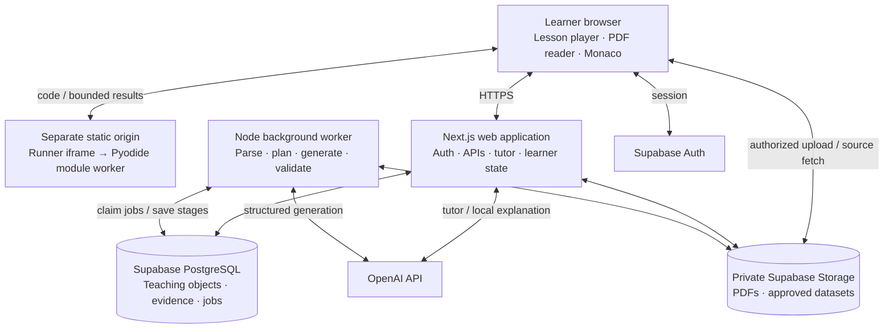

# Architecture

Consolidated proposed design, September 8, 2026. Inputs read in full: [PROJECT_SCOPE.md](PROJECT_SCOPE.md), [standout.md](standout.md), and [TEACHING_SYSTEM.md](TEACHING_SYSTEM.md). Delivery/gates: [EXECUTION_PLAN.md](EXECUTION_PLAN.md). All-source coverage and release placement: [REQUIREMENTS_MAP.md](REQUIREMENTS_MAP.md).

## 1. Architectural decision

Implementation status and temporary local-prototype boundaries live in [BUILD_STATUS.md](BUILD_STATUS.md). This document describes the target architecture, not a claim that all components are implemented. Domain topics, source identities and exercise content belong in lesson packages; the application shell, navigation, assessment and evidence rules remain reusable across subjects.

Build **one TypeScript application with one background worker, Supabase, and an isolated browser Python runner**. Keep product logic in ordinary modules in the same repository. The worker is a second process for long-running work, with shared types and deployment artifacts.

The central design is a **small learning compiler**: source representation → concept/teaching plan → validated, versioned lesson package → executable activity → learning evidence. These are typed objects and ordinary application modules. Generation produces the package; the player renders it; the tutor and evidence refer to the same stable identities. The player must support both authored and generated content.

This separates the probabilistic work of producing teaching material from the predictable work of presenting lessons, running tests, saving progress, and enforcing access.



Deploy the web and worker as two small services from the same codebase on a container host supporting persistent Node processes. Serve the runner as static assets on a separate origin with no application credentials. Supabase supplies the database, identity, and object storage. Host selection can follow budget and region requirements; it does not change the application design.

## 2. Stack and module boundaries

| Concern | Decision | Purpose |
| --- | --- | --- |
| Web application | Next.js App Router, React, TypeScript | One place for pages, authenticated APIs, and server-side tutor orchestration |
| UI | Tailwind; ordinary HTML/CSS; SVG for the first visual | Focused learning screens with a small component vocabulary |
| Interactions | React client components for the player, editor, visual, and source viewer | Keep browser runtime behavior explicit |
| Content schema | Zod discriminated unions, with versioned JSON content | Validate model output and renderer input against one contract |
| Data | Supabase PostgreSQL, SQL migrations, generated database types, Supabase client | Relational ownership and attempts; JSONB for nested teaching content |
| Background work | One Node worker; a Postgres jobs table and small claim/checkpoint functions | Durable generation without another queue service |
| PDF | PDF.js (`pdfjs-dist`) for per-page extraction and browser page rendering | Keep page identities and reuse one PDF toolchain |
| AI | Official OpenAI SDK, Responses API, structured outputs where applicable | A few explicit calls with typed inputs and outputs |
| Coding | Monaco plus a pinned Pyodide runtime in a module worker | Fast Python practice using the learner's browser |
| Verification | Type checking, focused unit tests, database access tests, Playwright workflows, content fixtures | Protect source fidelity, execution, persistence, and learner behavior |

Next.js distinguishes server and client components; keep credentials and data assembly on the server and mark interactive components explicitly. [Next.js documentation](https://nextjs.org/docs/app/getting-started/server-and-client-components)

Proposed repository structure; create directories as their milestone begins:

```text
src/
  app/                   # Pages and thin route handlers
  components/            # Lesson player, source viewer, visuals, editor
  domain/
    content/             # Schemas, IDs, validators, lesson projection
    sources/             # Extraction, passage references, coverage
    teaching/            # Concept routes, plans, glossary, review rules
    visuals/             # Typed state, reference transitions, replay
    learning/            # Evidence, misconceptions, receipts, reviews
  server/
    ai/                  # Typed calls, prompts, context assembly
    generation/          # Stage functions and publication checks
    db/                  # Queries, ownership helpers, transactions
  worker/                # Job claim loop and handlers
runner/                  # Separate static bundle; no server imports or secrets
supabase/migrations/
tests/fixtures/          # Source fixtures, authored lesson, expected outcomes
```

Routes call application functions; application functions call persistence and AI helpers. Share schemas between the renderer, worker, and server. Keep provider details inside `server/ai`; do not build a generalized provider framework. Pin tested dependencies at implementation time rather than specifying unverified versions here.

## 3. Source ingestion and provenance

1. The server creates an owner-bound source record and authorizes a private upload to its allocated object path. The browser uploads directly to storage. On completion, the server verifies object ownership, declared/actual size, PDF signature, and parseability; it does not trust the filename or MIME type alone.
2. Enqueue parsing after upload completion. Proposed prototype ceilings: 20 MB, 30 pages, and a separately configured extracted-text/token budget. Page count alone cannot bound generation cost. Parse with time and resource limits.
3. Extract page by page. Store immutable source bytes/checksum, parser version, physical page index, optional printed label, section path where known, and ordered text fragments. Retain text positions for usable passage locations; do not promise perfect reconstruction of complex PDF layout.
4. Flag empty text, abnormal replacement characters, obvious reading-order failures, and uncertain formulas. Show an extraction preview. A required unreadable passage blocks generation; never let the model silently reconstruct it as source truth.
5. Build a bounded source/concept preview: sections, definitions, assumptions, equations/code/figures where reliably extracted, prerequisites, objectives, intended activities, project opportunities, and ambiguous/unsupported areas. Let the learner verify scope before costly lesson drafting. The prototype chapter may fit context; larger courses use summaries for planning and original fragments for teaching. Preview content is a proposed map, not published teaching.

PDF.js exposes per-page text extraction and page rendering. Semantic sections, equations, and layout correctness still need application checks and review. [PDF.js page API](https://mozilla.github.io/pdf.js/api/draft/module-pdfjsLib-PDFPageProxy.html), [rendering examples](https://mozilla.github.io/pdf.js/examples/)

### Citation contract

Use application-created `source_id`, `extraction_version`, and `fragment_id`. A fragment has a physical `page_index` (zero-based internally), ordered text, and optional coordinates/section path. Store printed page labels separately because book numbering may differ from PDF positions. Show physical page numbers as one-based in the UI.

The model selects allowed fragment IDs; it does not invent page numbers or quoted text. A citation can include a checked character span within the immutable fragment. The server resolves the actual excerpt, page, and section. If exact text mapping is unavailable, link the real page and say so.

Keep **material kind** separate from **provenance**. Material kinds include original excerpt, explanation, generated example, generated practice, and generated visual. Original reading renders exact stored passage text. Generated teaching remains labeled by kind, with claim-level references where needed.

SourceLock provenance states are `source_locked`, `supplemental`, `inferred_prerequisite`, `external_example`, and `uncertain_review`. A block can contain separately attributed claims; do not label every sentence source-locked because one citation exists. Record references, origin rationale, review status and any ambiguity. An invented teaching example is labeled generated/supplemental; `external_example` needs its actual origin. A dependency inferred by the planner is not a textbook claim.

References must belong to the authorized source/version. Existing IDs prove location, not support: semantic review must establish support before assigning `source_locked`. Required uncertain definitions/equations block publication; optional disputed context can remain explicitly qualified after review. Preserve source caveats, assumptions and apparent errors. Future multi-source synthesis must show disagreements and their type instead of silently choosing one account.

## 4. Lesson and curriculum contracts

### Source, concept and teaching representation

Keep a versioned `conceptPlan` in course/job JSONB initially. Each local concept has an application-assigned ID, canonical/source terms and aliases, concept type, source references, objective, assumptions/invariants, prerequisites, misconception IDs, suitable representations, expected evidence, and realistic application. Store concept relations as edges. IDs do not depend on English display text.

The planner selects an entry strategy and cognitive sequence before prose. Record why the visual, example, counterexample, exercise, and final proof exist. A small routing table guides supported concepts: algorithms → invariant/trace/edge cases; math → quantities/parameters/limits; ML → data/representation/objective/optimization/evaluation. Add systems, statistics, engineering and research strategies when those topics ship. No universal pedagogy engine or separate concept service is needed.

### Teaching objects

A lesson package contains:

```text
schemaVersion, lessonKey, revision, sourceRevision
title, objective, conceptIds, prerequisiteConceptIds
conceptPlanVersion, entryStrategy, planningRationale
steps[]
exercises[]
project?                  # Requirements + milestones referencing exercises
reviewTaskRefs[], glossaryVersion, displayStringsByLocale
estimatedDuration        # Estimate, revisable from observed use
generationMetadata       # Prompt/model/runtime versions; server-side
validationReport         # Checks and review outcome; server-side
```

`lessonKey` identifies the learning unit across revisions. The database `lesson_id` identifies one immutable published version. Step and exercise IDs are stable within that version. Every exercise names the concepts taught/tested, required prior concepts, assistance policy, difficulty band, and whether it is practice or assessment. An application-assigned `exerciseFamilyId` follows the same task through retries, repaired revisions, and cosmetic variants; a genuinely new assessment task gets a new family ID. This prevents regenerated copies from inflating independent evidence.

Every major teaching object records `objective`, `conceptIds`, `prerequisiteIds`, `learnerStateRequired`, `cognitiveAction`, `misconceptionTargets`, `verification`, `scaffoldingLevel`, `sourceRefs/provenance`, `localizationKeys`, `accessibilityFallback`, and QA status. A step can inherit unambiguous lesson-level values rather than duplicate them. Example purpose distinguishes canonical example, variation, boundary, counterexample, realistic application, and transfer. Planning metadata stays available for review without cluttering the learner UI.

Start with six step types:

| Type | Content | Rendering |
| --- | --- | --- |
| `reading` | Source fragment/span references | Original excerpt and open-page action |
| `explanation` | Semantic layer, safe text/math/example/code/visual references, provenance | Focused reasoning, worked examples, formalism and optional depth |
| `visual` | Allowlisted component, typed state/controls, prediction and expected outcome | Purpose-built interactive component and equivalent textual view |
| `question` | Exercise ID | Choice, prediction, short answer, or numeric response |
| `code` | Exercise ID | Task and Monaco/Pyodide workspace |
| `project` | Requirements, rubric, milestone exercise IDs | Guided milestones or independent brief |

Exercise objects add `activityKind` (including prediction, debugging, teach-back, transfer and proof), required evidence, misconception/test mappings, difficulty estimate, verification method, scaffold/hint policy, transfer context and exposure lineage. Verification methods include exact/numeric comparison, Python tests, trace/invariant checks, or a versioned written rubric; implement only what current tasks need. Difficulty starts as an estimate, with solve/hint/attempt evidence retained for later calibration.

Proof reuses questions/code/projects with stricter help/source policy and unseen-task selection. Break It is a debugging task; What If? pairs a committed prediction with a deterministic experiment; Xecute opens the concept's validated activity sequence. These do not require separate services or renderer systems.

Project objects contain requirements, skills/concepts, constraints, data/environment, milestones, allowed tools, failure points, tests/rubric, hint policy and optional extensions. At M6, store separate guided and independent briefs. A short written defense records why the learner chose an approach, its limitations and what they would test next. A project can reuse code/question components; no second IDE is needed.

Keep reference solutions, answer keys, reserved hint rungs, and reviewer notes outside the learner-facing package. Release fields through explicit server projections. Tests withheld until Submit are still inspectable once sent to a browser.

Render generated text as sanitized Markdown with raw HTML disabled and safe link protocols. Render equations with a restricted math renderer. Do not evaluate generated JSX, MDX, JavaScript, arbitrary SVG markup, or formula strings. AI selects component configuration; application code owns execution and layout.

### Visual state and synchronized representations

The first primitive is an array-search trace. Its configuration defines initial values, stable object IDs, controls, prediction checkpoint, expected behavior, semantic labels and accessibility fallback. Application code computes the reference transitions. A second primitive for gradient descent uses a predefined objective/derivative pair and validated parameter ranges; do not evaluate generated formula strings.

Use one authoritative semantic state and replay cursor for geometry, code highlighting, equation terms, active values and concise explanatory text. A compact trace frame carries `runId`, sequence index, event kind, object/value state, code location, optional equation-term IDs and narration key. State and labels are separate; these are component-specific TypeScript contracts, not a general animation language.

- Preserve stable array/node identities through transitions. Keep a selected value visible while it changes; camera/framing and emphasis follow the active reasoning.
- Capture prediction before revealing the outcome. Optional confidence belongs to the committed answer. Changing input starts a new experiment; it does not overwrite the earlier prediction/result.
- Support useful controls for the first primitive: keyboard prediction, step forward/back, play/pause, replay/reset and value inspection. Add scrubbing/comparison where the trace warrants it.
- Store parameters, seed where applicable, run identity, cursor, selection and paused state in lesson progress. Replay from captured states without rerunning the model or Python. Pane changes and reload preserve context; incompatible component versions require an explicit reset.
- Reduced motion uses discrete states; a semantic table/text description exposes the same values and outcome. Use redundant shape/label cues with color, accessible equations, adjustable code typography, and layout space for longer translated labels.
- Validate ranges, axes, units, signs, geometry, transitions and representation correspondence. Nonfinite/invalid values get an explicit error state. Rendering/interpolation can be smooth without becoming the authority for computed values.

### Translation-ready content

Keep display strings and visual labels in a locale map; equations, variable IDs, units, grading logic and state stay locale-neutral. Maintain a course glossary of canonical term, source term, aliases/abbreviations, localized terms and notes. English ships first. Avoid language-dependent conceptual puzzles; test text expansion early. Actual translation/RTL/locale conventions require technical-meaning and interaction QA when those languages ship.

### Chapter and course extension

At M6 store an ordered outline containing module IDs, lesson keys, objectives, concept IDs, prerequisite edges, and source coverage. Check edges for cycles and missing concepts. Each prerequisite must appear earlier, be explicitly assumed, or have a named refresher. A JSON adjacency list is enough. Shared glossary, notation, visual conventions and appropriate running examples maintain coherence across lessons; project scaffolding decreases intentionally.

Generate the outline first, validate it, then generate the first module and prepare the next lesson as needed. Use bounded section context for each lesson. Only validated lessons are ready to open; show future lessons as planned/preparing. Distinguish covered, omitted, unsupported, and pending source sections. A generated outline is not a completed course.

At M7 introduce a small persistent `concepts` registry, prerequisite relations and reviewed course-to-concept mappings. Keep course-local evidence/context and source-specific assumptions; a matching name alone never proves equivalence or grants mastery. A fresh diagnostic can support skipping prior material. Automated entity matching, Knowledge Diff and cross-source conflict reconciliation arrive with source expansion, using versioned mappings rather than rewriting old evidence.

Once learning starts, freeze the outline revision for that course. Course-wide replanning is explicit. Published lessons are immutable: a repair produces a new revision, and existing attempts stay attached to their original version. Resume an existing learner on the pinned version; offer an explicit restart/migration rather than silently moving their checkpoint.

## 5. Minimal data model

Use relational rows where ownership, history, concurrency, or lookup matters. Keep nested lesson text, visual configuration, outline, and project milestones in validated JSONB. Do not normalize every paragraph or exercise subtype.

| Table | Important fields and responsibility |
| --- | --- |
| `sources` | Owner, storage path, hash, parser/extraction version, page count, status, extraction report, deletion state |
| `source_fragments` | Source/version, fragment ID, page index/label, order, section path, text, optional coordinates |
| `courses` | Owner, source, goal/background/depth defaults, source/concept/teaching plan JSON, glossary, outline/revision, status; prototype has one lesson |
| `lessons` | Course, lesson key, revision, learner-safe content JSON, schema version, status, review/validation summary, content hash |
| `private.lesson_keys` | Lesson version, reference solutions, answer keys, unrevealed hints, review details; no client grants |
| `private.jobs` | Owner/resource IDs, kind, stage, status, request key, lease token/expiry, retry count, next run time, stage artifacts, usage/error |
| `lesson_progress` | User + lesson version, checkpoint, completed step IDs, drafts, visual/run/cursor snapshot, proof session state, detour return location, save revision |
| `attempts` | User, lesson version, exercise ID/family ID, submission ID, answer/code, result/test IDs, runtime version, assistance, difficulty, evidence kind, timestamp |
| `learning_events` | Append-only event ID, owner, lesson/concept/exercise/family/session IDs, type, attempt/run/message reference, bounded payload, evaluation origin, server time, rule/rubric version, idempotency key |
| `tutor_messages` | User, lesson version, step/exercise context, role, content, source refs, linked hint/reveal event, timestamp |
| `explanation_variants` | Lesson version, object/layer ID, depth, locale, prompt version, typed content/provenance, validation status |
| `concept_progress` | Add at M6 if needed: user + course concept, derived evidence flags, misconception observations, last practice, next review, derivation version |

Supabase Auth supplies identities. Derive concept summaries/receipts from attempts plus immutable learning events; `concept_progress` is a rebuildable cache. Events reference answers/code in `attempts`, messages, and bounded saved trace snapshots rather than duplicating every payload. A delayed AI rubric result is a new linked evaluation event, not an overwrite of the answer. Deletion removes owner data despite its ordinary append-only behavior.

At M7 add `concepts`, `concept_relations` and `course_concept_mappings` only for the reviewed persistent registry. No separate tables/services are required for every teaching role, modality, graph node subtype, project milestone or receipt.

Essential constraints: foreign keys for source/course/lesson ownership chains; unique source fragment IDs per extraction; unique `(course_id, lesson_key, revision)`; unique submission/event ID per user; unique progress row per user/lesson; unique explanation-variant key; unique job request key. Validate nested IDs and event transitions against the exact lesson; the server assigns canonical concept/family mappings and result origin. Save an attempt and its synchronous evidence atomically. Browser clients cannot assign grades, confirmed misconceptions or capability states.

Use RLS and explicit grants for exposed tables and private storage. Next.js obtains user-scoped data under the authenticated session; privileged worker operations use server-only access and explicit owner/resource checks. The `private` schema is not exposed through the public Data API. Return sanitized job status through the server. Supabase secret/service-role access can bypass RLS, so it must never reach the browser or runner. [Supabase RLS documentation](https://supabase.com/docs/guides/database/postgres/row-level-security)

Private storage reads require an authorized request or an expiring signed URL. Use short-lived source-view URLs, owner-bound object paths, and no public PDF bucket. [Supabase storage access model](https://supabase.com/docs/guides/storage/buckets/fundamentals)

## 6. Generation pipeline and recovery

Use a short sequence of explicit functions, with a durable checkpoint between expensive stages:

```text
parseSource → analyzeSourceAndConcepts → previewScope
  → planTeaching(objectives, misconceptions, strategy, activities)
  → draftTeachingObjects(plan, original fragments)
  → technicalAndPedagogicalReview
  → editorialRepairAndAccessibilityChecks
  → runtimeAndHumanReview
  → publishLesson
```

Parsing is ordinary software. Source analysis produces the source map, concepts and prerequisites; the preview lets the learner choose the intended scope. Planning records objectives, misconceptions, entry strategy, example/counterexample purposes, visual/interaction specification, exercise progression and proof/retention design. Drafting produces the typed teaching content. Each artifact is persisted and inspectable.

Teaching-system roles are distinct responsibilities, not mandatory separate models/processes. The source analyst/curriculum planner can share a bounded call; teacher/visualization/exercise roles can share drafting; technical and pedagogy review produce separate findings even within one critique call; an editor handles targeted repair. Start with roughly four principal AI operations (source/concept analysis, teaching plan, draft, critique) plus at most one repair/edit operation. Accessibility, reference integrity and known runtime checks are deterministic where possible. Add calls only for measured quality/context needs; do not turn 15 conceptual stages into an agent swarm.

Use structured outputs and validate again with the application schema. Handle refusal, incomplete output, invalid references, and semantic failure explicitly. Schema conformance does not guarantee correct teaching. [OpenAI structured outputs documentation](https://developers.openai.com/api/docs/guides/structured-outputs)

Store a compact QA report per category with finding, affected object, severity, evidence, repair status and reviewer/version:

1. **Fidelity and technical:** references/excerpts, meaning/assumptions, equations and units, legal visual values/transitions, test/reference validity, and unsupported claims.
2. **Pedagogy:** prerequisite availability, specific mental-model entry, action/objective mapping, misconception/counterexample relevance, meaningful prediction, decreasing scaffolding, real transfer and retention design.
3. **Editorial:** source-specific opening, consistent glossary/notation, concise prose, precise feedback, honest realism and analogy limits. A lightweight linter flags repeated phrases/headings, filler, trivial distractors and unjustified passive spans; warnings require judgment, not mechanical word-count rejection.
4. **Accessibility/localization readiness:** keyboard and textual equivalents, reduced-motion meaning, semantic math/code labels, text expansion, and display strings separated from state.
5. **Runtime:** reference and representative wrong solutions run in the same isolated browser runtime used by learners; expected traces and graph/numeric invariants are checked where applicable. Inspect expected results independently so a generated solution/test pair cannot share an unnoticed mistake.

Use teaching §49's twelve scored dimensions and gates as specified in the execution plan: correctness 5; fidelity, intentionality, exercise quality and human voice at least 4; normally revise mean below 4.3. Failed technical checks cannot be waived by an average. The reviewer accepts the exact content hash, component/runtime versions and QA report. Repairs re-run affected checks and invalidate prior approval. Model critique is a filter, not the publication authority.

No uploaded, generated, or learner Python runs inside the Next.js server or generation worker. The pilot uses the reviewer browser for execution. Before unattended publication, add a disposable, isolated validation runtime with no production secrets, constrained network/resources, and explicit test reports. This is a later operational addition, not an implied capability of the Node worker.

### Job lifecycle

```text
queued → running → succeeded
            ├── retry_wait → running
            ├── failed
            └── cancelled

lesson: draft → validating → needs_review → ready
                          └── failed
```

Successful generation means a draft is prepared for review; it does not imply publication. Parsing/analysis jobs can finish earlier and leave the source ready for scope selection. The learner sees real stages and separate review status. A pre-reviewed sample can be offered immediately with its own source identity; a first uploaded lesson becomes usable only after its own gate, while later lessons continue preparing.

- Create a source/course request and its job in one database transaction after verifying the uploaded object. Deduplicate repeated requests by owner, source revision, requested objective/settings, and request key. A deliberate regeneration gets a new revision.
- Claim a queued job with a short SQL transaction using `FOR UPDATE SKIP LOCKED`; set a lease token and expiry, then release the transaction before network/model calls. PostgreSQL documents this locking option for queue-like tables. [PostgreSQL SELECT documentation](https://www.postgresql.org/docs/current/sql-select.html)
- Start with one worker and one generation at a time. Heartbeat while processing. After a crash, an expired lease makes work claimable again. Save completed stage output so recovery resumes at the failed stage.
- Every checkpoint and publication write checks the current lease token, target revision, and resource deletion/cancellation state. Stale workers cannot publish after a retry or deletion.
- Expect at-least-once execution. Enforce unique output/publication keys so retries cannot create duplicate visible lessons or attempts. A crash after a model response can still cause a repeated billable API call; record this rather than promising exactly-once execution.
- Proposed initial policy: three total attempts for transient timeouts/rate limits with backoff and jitter; one content repair. Unsupported inputs and persistent validation failures stop with a useful reason. Budget exhaustion stops further paid calls.
- Publish the complete learner-safe package, private answer material, and ready status atomically. A failed replacement leaves the previous published version usable. Reject publication if the review hash differs from current content.

The browser polls status while work is active, backing off when waiting for review. Reloading or closing the tab does not cancel work. A Retry action resumes eligible failed work; it does not rerun completed stages. This needs neither WebSockets nor a workflow designer.

## 7. Python execution and evaluation

Use a module Web Worker inside a static runner iframe on a separate origin. Pyodide documents worker execution for keeping Python off the UI thread, and also exposes browser-backed HTTP functionality. A worker alone does not isolate Python from all browser capabilities. [Pyodide workers](https://pyodide.org/en/stable/usage/webworker.html), [Pyodide HTTP API](https://pyodide.org/en/stable/usage/api/python-api/http.html)

The parent owns the editor, saved drafts, and authenticated requests. It sends only code, approved exercise tests/data, runtime settings, and a run ID to the runner. The runner returns bounded text/results. It receives no auth token, signed PDF URL, private source library, or server secret.

Use a separate site where practical, otherwise host-only auth cookies with no shared cookie domain. The runner origin serves static runtime assets and has no authenticated API. Apply a restrictive CSP to both its document and worker responses: only the pinned runtime assets/approved packages can load; application endpoints and arbitrary external network access are excluded. Use the minimum iframe permissions needed; disable navigation of the parent, popups, forms, and privileged browser capabilities.

Use exact target origins and validate message origin, source window, schema, run ID, and payload limits. The parent accepts only the narrow runner result protocol; it does not execute returned HTML, URLs, or instructions. Separate-origin embedding and origin/source validation follow browser isolation and messaging guidance. [MDN iframe documentation](https://developer.mozilla.org/en-US/docs/Web/HTML/Reference/Elements/iframe), [MDN postMessage documentation](https://developer.mozilla.org/en-US/docs/Web/API/Window/postMessage)

### Runtime behavior

- Lazy-load and cache the pinned runtime assets. Show loading, running, stopped, failed, and complete states. Prewarm when the learner approaches a code step.
- `Run` executes visible checks and produces feedback. `Submit` starts a fresh worker/runtime state and executes the full exercise suite, then records one attempt. Fresh globals alone do not reset modified interpreter/module state.
- The parent/runner controller keeps a wall-clock deadline and can terminate/recreate the worker. Stop and timeouts preserve the editor draft. Cap stdout/stderr, result size, code size, and dataset size.
- Proposed initial ceilings: 5 seconds of execution after runtime initialization, 64 KB code, 64 KB output, and 1 MB exercise data. Set a separate runtime-load timeout based on measured devices. Review these limits in M1; browser memory use is not a reliably enforceable per-task quota.
- Standard-library exercises first. Add only preapproved, pinned packages and matching lesson/test fixtures. Do not install arbitrary imports automatically or execute shell commands.
- The test harness checks expected outputs and edge cases. Reference solutions must pass; starter/known-bad implementations must fail meaningful cases. Do not grade algorithmic complexity using browser wall time; use operation counts or reviewed reasoning where suitable.

### Grading boundary

Tests delivered to a browser are inspectable, and reported results can be forged. Label persisted evidence `client_reported` for Python. This is appropriate for self-study feedback; it does not establish verified certification or confidential examination results.

The server validates exercise identity, test IDs, result shape, runtime version, ownership, and submission deduplication. It never accepts a client-supplied mastery score. Closed questions can be graded server-side using private answer keys. Short explanations receive rubric-based AI feedback marked as such; ambiguous answers trigger a follow-up and cannot alone establish mastery.

### Bounded Trace My Code at chapter launch

M1 includes a feasibility spike; M4 can ship an explicitly labeled **reference trace**. M6 targets a real trace of a supported learner function: one synchronous function, named scalar locals and a bounded numeric array, no recursion, async/generators, threads, native-library internals, or arbitrary object graph inspection. Normal Run remains available when tracing is unsupported.

Candidate mechanism: compile the learner source with a known filename, identify the target code object, and use `sys.settrace` inside the isolated Pyodide worker to capture only the target's execution. Python documents call/line/return/exception events; line events report state **before** executing that line. Label the highlighted line as next to execute and avoid mismatching pre/post values. Availability and behavior must be proved in the pinned Pyodide/browser configuration; Python documentation alone is not that proof. [Python tracing reference](https://docs.python.org/3/library/sys.html#sys.settrace)

The exercise declares watched roles such as array, target, low, high and midpoint. Bind these to actual learner variable names using the task contract or a small explicit mapping. Missing/unsupported values stay unknown. Serialize only bounded built-in scalar/list values, without invoking arbitrary object representations. Learner-created invalid bounds or a non-shrinking interval must remain visible; never replace them with the reference algorithm's correct state.

Capture immutable snapshots in small bounded batches and stream them through the existing runner protocol. Keep one replay cursor over those snapshots. Proposed trace ceilings: 500 frames, 100 list elements per snapshot, 1 MB total trace data, plus the run deadline; flag truncation. Persist bounded trace data with an explicitly saved debug run/attempt, not every keystroke. Early batches survive a stop/timeout so an infinite-loop failure remains inspectable. Parent-side limits still apply if tracing is disabled or tampered with; trace hooks are not a security boundary.

A trace run binds source snapshot/hash, input, runtime/component versions and state sequence. Editing code or inputs invalidates it for the current editor; retained replay displays its captured source. Equation highlights describe the executed operation only when the mapping is valid; otherwise label the equation as the reference rule for comparison. Reference solutions/comparisons follow the assistance policy and are withheld until appropriate. If the spike fails, retain reference trace and mark learner tracing incomplete; do not claim M6's trace gate passed.

## 8. Tutor, depth, and learning evidence

### Tutor context and hints

Build context server-side from the authorized lesson/activity: objective, taught/prerequisite concepts, source fragments, glossary, learner goal/depth, current editor snapshot and latest Run result, current visual/trace state, misconception evidence, recent attempts, assistance and bounded message history. Accept bounded draft/run/state context for the active authorized exercise and label it client-reported; debugging help does not require Submit or create a graded attempt. Resolve selected paragraph IDs against the source. Start retrieval with explicit lesson references and section/full-text lookup; add embeddings only after measured failures.

Treat uploaded source, learner messages, and code as untrusted content. None can change permissions, execute tools, retrieve another user's source, or overwrite assessment rules. The tutor has no shell or arbitrary browsing tool. If evidence is unavailable, it should say what is missing and direct the learner to the source or relevant prerequisite.

Maintain the hint rung on the server:

```text
orient to goal/invariant → diagnostic question or error location
  → relevant principle → structural hint/pseudocode → requested worked explanation
```

Use prevalidated diagnostic hints first; generate context around the current rung when useful. Record distinct hints so the tutor cannot offer the same nudge reworded repeatedly. Do not provide reference solutions before reveal. This reduces leakage but cannot prevent the model independently solving a task; evaluate unwanted reveals. Explicit reveal or observed solution disclosure marks assistance cumulatively across the exercise family. The tutor's voice is precise and concise, with specific failure feedback instead of automatic praise or a full lesson recap.

Proof starts with a fresh eligible task, source pane closed, no hints shown, and a blank workspace where suitable. A server-owned proof session records task exposure, hint/source/solution use, exits and results. Help remains available: opening source or requesting task guidance converts the proof into assisted practice; the UI explains this without punishment. Do not claim proctoring or prevention of outside help. Offer a fresh proof later.

Teach-Back uses a structured rubric for correctness, causal mechanism, missing reasoning, terminology and misconceptions. Project defense reuses this on specific learner decisions. Feedback cites the answer evidence and asks a targeted follow-up for ambiguity; a fluent explanation or an AI score alone cannot establish independent skill.

Expose Explain, Nudge and Debug contextually in the prototype; reuse the same orchestration for Question Me, Challenge Me, Review Me, Connect It and Why This Matters as chapter/course capabilities ship. Avoid eight separate chat systems. Repeated diagnostic failures can offer a small detour; inactivity alone is not proof of confusion and must not trigger an unsolicited solution.

### Adjustable depth

Keep stable semantic layers: intuition, concrete example, mechanism, formal definition, derivation/proof, implementation, edge/failure cases, and research/industry context. Each layer uses the existing safe text/math/code/visual renderers and source provenance. Cache requested layer variants by lesson version, object/layer ID, depth, locale and prompt version. Use the same objective/fragments and preserve the current layer/visual state on failure.

Five learner profiles are ELI5, beginner, standard, advanced and expert. They influence representation, reasoning and disclosure, not just length. A learner can reveal a formal definition or inspect code without changing the concept or profile; ELI5 remains technically correct and analogies include their limits where needed.

Depth may change the selected teaching representation or example using validated components; it does not alter exercise identity, grading rules, lesson IDs or completion. Prerequisites need a separate refresher. Beyond-source content is supplemental with real references where available. Live tutor/layer output receives bounded structural/provenance and semantic checks and is labeled live AI help, never automatically SourceLock-approved. Promotion into a canonical published lesson requires the full review gate.

### Progress and simple adaptation

Save navigation, visual replay state and code drafts separately from immutable submissions. Debounce remote saves, flush on explicit Continue/Submit, and keep a user-scoped local recovery copy until acknowledged. Show save failure and preserve work. Use a save revision to detect conflicting tabs; never silently overwrite a newer draft. Client progress updates cannot write proof policy, assistance or derived mastery fields.

### Placement and open navigation

Follow [LEARNING_PATH.md](LEARNING_PATH.md). Reuse versioned assessment activities, attempts, learning events and the existing concept prerequisite map. Store a small course enrollment JSONB profile: self-reported background by domain, chosen entry mode, current recommendation with reason/evidence IDs, and assessment/routing rule versions. Do not build a separate assessment service or global proficiency score.

A fixed reviewed diagnostic bank maps each item to concept IDs and a rubric. Evaluate readiness per concept with explicit rules; two independent successful signals support a provisional recommendation, missing answers stay unknown, and assisted or AI-only evidence cannot grant independent readiness. Record assessment purpose (placement, checkpoint, practice or proof) in the activity/session contract. A diagnostic result is not a mastery receipt or a delayed-retention result. Retakes append attempts; they never replace history.

Navigation uses authorized published lesson IDs and pinned versions. Prerequisite gaps display advisory links, never an academic access lock. Availability and authorization still apply. A jump saves the existing checkpoint/draft and return location, then opens the destination; it cannot write completion or mastery. Keep navigation status separate from evidence-derived capability. Planned outline entries display their actual preparation state and cannot open unpublished teaching. Course-local JSONB and existing SQL/event derivations are sufficient.

M4 supports these entry choices and a small authored assessment for the available lesson set; M6 adds module checkpoints, M7 full supported-course navigation. Verify bypass, unknown/assisted answers, per-concept routing, versioned retakes and draft preservation as described in the learning-path acceptance checks.

### Evidence events and misconception observations

Use a small append-only `learning_events` table, ordinary SQL and pure derivation functions. No event bus, distributed event-sourcing framework or generalized analytics platform is needed.

| Event family | Evidence retained |
| --- | --- |
| Prediction committed / outcome revealed | Activity/run IDs, submitted prediction, optional confidence, committed input/seed, outcome, reveal order |
| Attempt submitted / evaluated | Exact exercise family/version, answer reference, test/rubric result, evaluator/runtime version |
| Hint / source / solution consulted | Proof session or exercise family, assistance kind/rung, server time |
| Teach-back / defense evaluated | Answer reference, rubric version, causal-reasoning findings, uncertainty and supporting passages |
| Debug / transfer / delayed review | Originating attempt, task/context family, targeted misconception and elapsed time since prior evidence |
| Detour offered / entered / returned | Diagnostic reason, prerequisite, supplied activity and saved return location |

The server validates allowed transitions and assigns event meaning; a client cannot post `mastered=true`. For prediction activities, store commitment before returning the reveal, and retain the submitted input/seed with it. The browser may inspect accessible runtime data, so this orders the learning interaction rather than guaranteeing examination secrecy. Retries use stable event keys; re-evaluations append a superseding evaluation instead of double-counting a second solve.

Each result identifies origin: `server_deterministic`, `client_reported`, `ai_rubric`, or `human_reviewed`, with rule/rubric version and supporting IDs. Confidence is the learner's self-report, not a measured probability. Operational failures such as runtime load errors do not count as conceptual mistakes.

Start each supported concept with a few reviewed misconception IDs, e.g. unsorted-input assumption or non-shrinking boundary. Map plausible distractors, failed-test classes, trace invariants and rubric observations to candidate misconceptions. Store observations and derive `unknown`, `suspected`, `observed`, or `resolved` with evidence links. One ambiguous failure is suspected; repeated independent diagnostic signals or explicit reviewed reasoning can establish observed. A fresh targeted successful check can resolve it. AI hypotheses remain distinguishable from observed facts.

Intervention selection is a short rule table: choose a counterexample, trace, What If? experiment, targeted practice, Teach-Back or smallest prerequisite detour. Repeated failure can indicate a bad exercise or instruction, so route content defects to review instead of blaming the learner. Aggregate Failure Atlas and learned intervention selection wait for reviewed longitudinal data.

Track completion, capability evidence and active weaknesses separately. Derive a receipt with evidence flags rather than forcing all learners into an uncalibrated percentage:

| State | Proposed rule |
| --- | --- |
| Encountered / practiced | Visited teaching or submitted practice; no inference of independent understanding |
| Independent | Two distinct unaided successful task families, including an unseen proof task and a blank implementation where the objective requires coding |
| Transfer demonstrated | Unaided success in a reviewed changed-context task; a renamed copy is insufficient |
| Retained | A successful fresh delayed check after prior independent evidence, using the scheduled interval |
| Needs practice | Active observed misconception or a failed later check; keep past successes visible with current uncertainty |

Count each exercise family once; exclude known copied/revealed or previously hinted tasks and carry assistance across its revisions/variants. One accepted task can support multiple capability flags when it actually meets their criteria, but cannot count as two independent task families. AI rubric judgment alone never establishes coding independence. The app cannot reliably detect outside copying; UI wording must reflect formative evidence and its origin.

The **Mastery Receipt** shows supporting task results, blank-editor work, debugging, transfer, hints/source assistance, teach-back, delayed recall and remaining gaps. Include evidence/rule versions and evaluation origin. It is a derived view, not a new grading service or certification. The lesson ending links to this receipt and a useful next action. Keep earlier successful evidence visible when newer results suggest review.

Design a named delayed check in the prototype. At M6 schedule changed-context reviews after proposed intervals of 3, 7, then 14 days following successful independent checks. A failed review prompts targeted practice; the learner can defer. Compute due work when the app opens, without a notification service. At M7 interleave prior concepts in new lessons/projects and choose among reviewed activities based on prerequisites, misconception evidence, goal, available time and assistance dependency.

An M6 prerequisite detour is the smallest validated explanation/example/action/check that closes the diagnosed gap. Store its return checkpoint and reasoning. Reuse a reviewed refresher when possible; generated detours use the same publication gate, so do not promise instant creation. Missing content gets a clear preparing state. Return to the original task without rewriting the course; exposure to task-solving details is counted as assistance where relevant.

## 9. Application interfaces

Keep route handlers thin and use the same server/domain functions from the worker and review tools. The following is the initial API surface, not a requirement to build an independent API product.

| Interface | Behavior |
| --- | --- |
| `POST /api/sources` | Authenticate, allocate source/object path, return authorized upload details |
| `POST /api/sources/:id/complete` | Verify upload and queue parsing idempotently |
| `GET /api/sources/:id` | Return extraction/concept/strategy preview, coverage, plan version and input status |
| `POST /api/sources/:id/generate` | Validate selected preview version, objective/settings and budget; create course/job; return `202` |
| `GET /api/jobs/:id` | Return owner-scoped stage, recoverable error, and resulting lesson link |
| `POST /api/jobs/:id/retry` | Resume eligible failed work within retry and spending limits |
| `GET /api/lessons/:id` | Return ready learner content and authorized source links, never private answer fields |
| `PATCH /api/lessons/:id/progress` | Save allowlisted checkpoint/draft/visual state using expected save revision |
| `POST /api/lessons/:id/attempts` | Validate exercise and submission ID, grade where server-verifiable, append evidence |
| `POST /api/lessons/:id/events` | Accept a narrow action union for prediction commitment/reveal, source consultation and detour lifecycle; derive server-owned evidence |
| `POST /api/lessons/:id/proof` | Start/resume an authorized fresh-task proof session and its assistance policy |
| `GET /api/courses/:id/evidence` | Return derived concept receipts, observed misconceptions and due reviews |
| `POST /api/lessons/:id/tutor` | Assemble authorized context; return grounded help and persist assistance |
| `POST /api/lessons/:id/explanation` | Return validated typed layer content for the selected depth/locale; count assistance if invoked in Proof |
| `POST /api/internal/lessons/:id/review` | Reviewer-only acceptance/rejection for the exact content hash and execution report |
| `DELETE /api/sources/:id` | Immediately revoke access and cancel dependent work; enqueue retryable cleanup |

All routes validate input, session, and object ownership. Cookie-authenticated writes also validate request origin/CSRF protection; rejecting CORS alone is insufficient. Rate-limit paid operations and apply per-user quotas. Generated content, job states, answer keys, evidence evaluation, proof policy and derived progress have no direct client write grants. Controlled server transactions enforce allowed mutations and ownership; RLS remains a backstop. Internal review uses an explicit reviewer allowlist, not learner-editable fields.

The only early admin interface is a preview of source, generated steps, test execution, validation findings, and accept/reject. Do not build a CMS, collaborative authoring environment, or admin analytics suite.

## 10. Reliability, cost, and release verification

### Operations

- Use managed Postgres/storage and two supervised application processes. Start with a single worker; increase concurrency only after measuring memory, API limits, database connections, and queue delay. Do not hold a database transaction while generating content.
- Keep API credentials, database access, and reviewer configuration server-only. User source/code content should not appear in ordinary logs. Store only the AI context needed for product behavior; tell pilot users that relevant uploaded material is sent for AI processing and authorized review.
- Log source/job/lesson IDs, stage, duration, model/prompt/schema/component/runtime versions, token usage, repair count and publication outcome. QA failure taxonomy: fidelity, prerequisite, explanation, slop, visual, interaction, exercise, verification, tutor, realism, localization. One error-reporting destination and structured logs suffice.
- Configure a token/output limit per model call, maximum calls/repairs per job, and per-user/session spending quotas. Reserve capacity atomically so concurrent requests cannot each consume the same remaining allowance. Cache parsed sources and accepted content per owner/revision; cache depth variants. Record failed work in cost totals.
- Keep model IDs in configuration. M0 selects one model using the content corpus; use that choice initially for generation and tutor unless latency/cost evidence supports a second. Keep price assumptions dated and configurable. Do not put speculative dollar amounts in product promises.
- Deletion marks the source unavailable, cancels leases/jobs and prevents publication. Durable cleanup removes dependent lessons, variants, attempts, evidence, saved traces, drafts, tutor context, mappings and storage objects through their APIs; rebuild any affected skill summaries so deleted evidence cannot support receipts. Retry partial failures and sweep abandoned uploads. Clear local recovery data on deletion/logout. Document provider/backup retention honestly before broader release.
- Track backup coverage for both database records and object storage; do not assume one includes the other. Before broader access, rehearse restoring one course and its source. Use reversible, additive migrations while old lesson schema versions remain in use.

### Focused verification

| Check | What it must prove |
| --- | --- |
| Content/schema tests | Invalid references, unsupported components, prerequisite cycles, and malformed model output cannot publish |
| Access integration | Account B cannot access A's source, storage object, lesson, job, tutor history, attempt, or draft; clients cannot read private keys or write ready/grade states |
| Runtime integration | Infinite loop stops, large output is bounded, repeated submissions start clean, draft survives reset, and runner cannot access application credentials/endpoints |
| Generation recovery | Worker kill, expired lease, duplicate request, model timeout, content repair failure, deletion during generation, and publication retry behave correctly |
| Learner workflow | Upload → preview → generate/review → source/visual → code/hints → project/assessment → reload/resume works on the supported browser/device set |
| Versioning | Changing explanation depth preserves IDs; a new lesson revision does not alter old attempts; conflicting draft saves do not silently lose work |
| Evidence/proof | Duplicate/re-evaluated results cannot inflate mastery; source/hint use affects Proof; ambiguous AI judgments do not confirm misconceptions; retention requires a delayed result |
| Trace/representation | Reference replay is deterministic; actual learner bugs remain visible; captured code/line/state align; partial traces survive timeout; invalid/unsupported state is explicit |
| Teaching/localization | All ten V0 teaching elements, concept-specific entry, counterexamples, glossary, separate labels, text expansion and keyboard/reduced-motion equivalents pass |
| Educational evaluation | The release corpus meets the publication rubric and fresh learners demonstrate transfer; tests and model critique do not replace subject review |

Use mocked AI for ordinary workflows. Every generation-system change runs the supported benchmark checks relevant to its layer; paid content generation is required when prompts/models/planning change. Test deployed worker/runner boundaries before the pilot and expand the corpus with supported domains. Exercise the declared browser/device set; coding may remain desktop-first while reading/review remain usable on smaller screens. Accessibility checks must assess equivalent learning, not just missing labels.

## 11. Decisions to preserve

| Decision | Why it earns its place now | Trigger for change |
| --- | --- | --- |
| Structured learning representation | Source/concept plans, teaching objects and stable lesson versions join pedagogy with execution | Promote nested objects only when querying/editing needs justify it |
| One codebase, separate worker process | Short request latency and recoverable generation with shared logic | Split a service only for a demonstrated operational boundary |
| Postgres queue and prerequisite data | Reuses required storage | Replace only after throughput/recovery/query limits are measured |
| Fixed visual components | Predictable interaction, correctness, and accessibility | Expand for concrete concepts in supported courses |
| One semantic replay state | Keeps code, visual, equation and narration consistent | Extend component-specific contracts when a supported topic needs more state |
| Browser Python | Immediate self-study execution without a per-learner server | Add trusted server execution for confidential grading, unsupported runtimes, or larger compute |
| Reviewer publication gate | Checks generated teaching and real test execution at pilot volume | Remove only after automated isolated validation and corpus results justify unattended delivery |
| Append-only evidence and simple rules | Misconception-aware practice and auditable receipts without invented precision | Learn calibration/adaptation only from sufficient reviewed evidence |

The early implementation should spend most effort on source fidelity, the lesson experience, exercise quality, and recovery from ordinary failures. Whole-book breadth, extra services, and advanced personalization follow demonstrated need.
